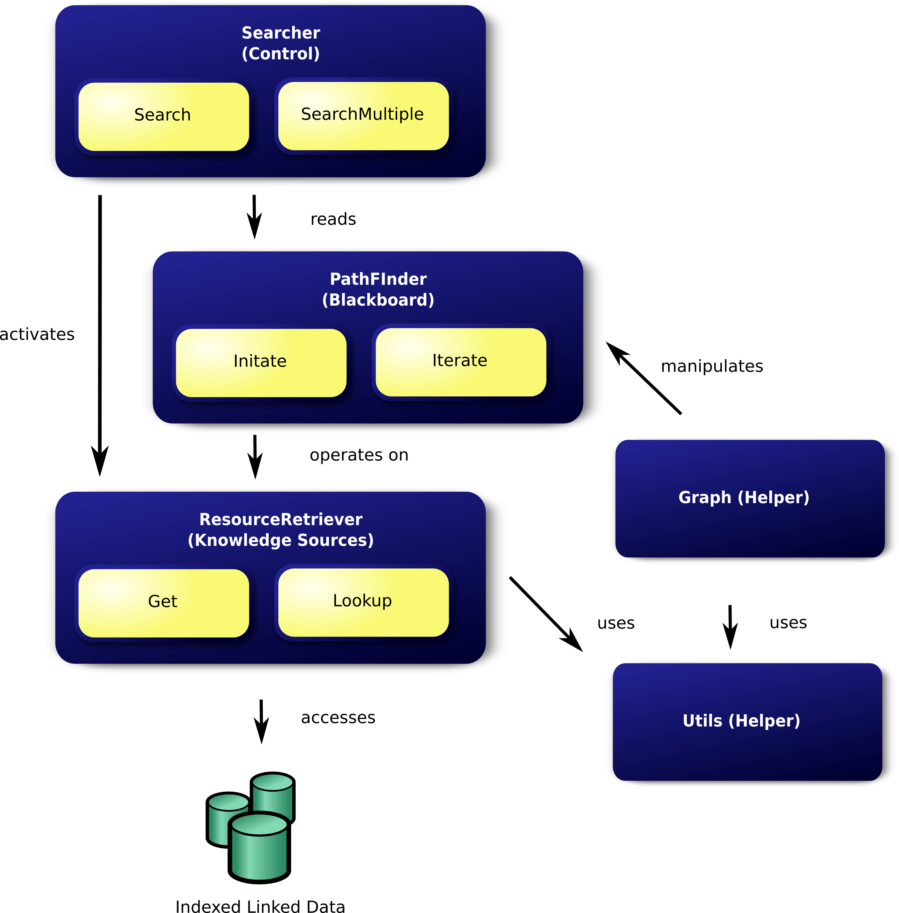

.. Everything is Connented Engine Service Documentation documentation master file, created by
   sphinx-quickstart on Wed Nov 28 14:58:50 2012.
   You can adapt this file completely to your liking, but it should at least
   contain the root `toctree` directive.

Welcome to Everything is Connented Engine Service's documentation!
=============================================================

Contents:

.. toctree::
   :maxdepth: 2
 
.. automodule:: core
    :members:
    
.. automodule:: search
    :members:
    
.. autoclass:: Searcher
    :members: 
    
.. autoclass:: DeepSearcher
    :members: 
    
.. automodule:: pathfinder
    :members: 

.. automodule:: graph
    :members: 

.. automodule:: resourceretriever
    :members: 
   
.. autoclass:: Resourceretriever
    :members: 

.. automodule:: utils
    :members: 

Architecture
=============

   The architecture implements the blackboard design pattern.

    
Indices and tables
==================

* :ref:`genindex`
* :ref:`modindex`
* :ref:`search`

